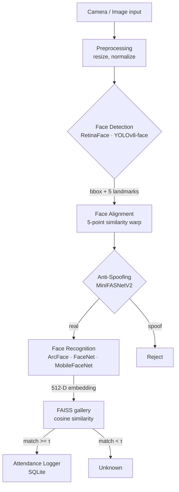

# Pipeline architecture

## Why two AI stages?

* **Detection** answers "where is a face in this frame?". Output: bbox +
  5 landmarks. The detector does not know identity.
* **Recognition** answers "*who* is in this aligned crop?". It produces a
  high-dimensional embedding designed so that two crops of the same person
  have high cosine similarity and crops of different people have low
  similarity.

Mixing the two roles into a single classifier (ImageFolder → CrossEntropy)
fails the moment a new student has to be enrolled — you would have to retrain
the entire network. Embedding learning sidesteps that: enrolling = saving a
new vector to FAISS.

## Two-stage transfer learning

| Stage | Backbone     | Head     | LR    | Epochs |
| ----- | ------------ | -------- | ----- | ------ |
| 1     | **frozen**   | trainable | 1e-3 | 5      |
| 2     | last 2 blocks unfrozen | trainable | 1e-4 (cosine) | 20 |

Stage 1 lets the new ArcFace classifier head settle before we touch the
pretrained representations. Stage 2 adapts the high-level features to the
target domain (your custom student set / camera / lighting).

## Metrics covered

* Verification (1:1) — Accuracy, TAR@FAR=1e-3 / 1e-4, ROC-AUC, EER, 10-fold CV
* Identification (1:N) — Top-1 / Top-5, macro Precision / Recall / F1,
  confusion matrix
* Visualisation — t-SNE of embedding space, ROC curve, score-distribution
  histograms
* Robustness — synthetic lighting benchmark (low-light, over-exposure,
  side-light, backlight)

## Anti-Spoofing

`MiniFASNetV2` is a tiny depth-wise separable CNN (~0.4M params) trained as a
binary classifier on real vs spoof crops (printed photos, phone-screen
replays). Train with::

    python -m scripts.train_antispoof --data-root data/raw/antispoof

At inference we plug it into `AttendancePipeline` between alignment and
recognition; spoof detections are rejected before they reach the gallery.
